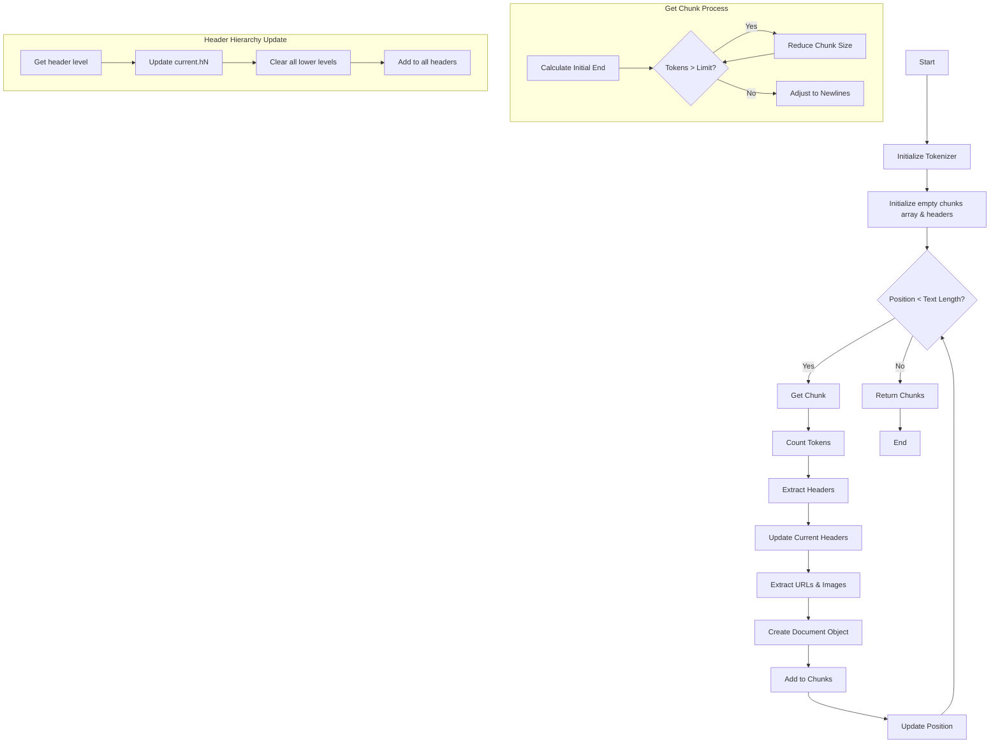

# Text Splitter

## Flowchart

```mermaid
flowchart TD
    A[Start] --> B[Initialize Tokenizer]
    B --> C[Initialize empty chunks array & headers]
    C --> D{Position < Text Length?}
    D -->|Yes| E[Get Chunk]
    E --> F[Count Tokens]
    F --> G[Extract Headers]
    G --> H[Update Current Headers]
    H --> I[Extract URLs & Images]
    I --> J[Create Document Object]
    J --> K[Add to Chunks]
    K --> L[Update Position]
    L --> D
    D -->|No| M[Return Chunks]
    M --> N[End]

    subgraph "Get Chunk Process"
    E1[Calculate Initial End] --> E2{Tokens > Limit?}
    E2 -->|Yes| E3[Reduce Chunk Size]
    E3 --> E2
    E2 -->|No| E4[Adjust to Newlines]
    end
    
    subgraph "Header Hierarchy Update"
        F1[Get header level] --> F2[Update current.hN]
        F2 --> F3[Clear all lower levels]
        F3 --> F4[Add to all headers]
    end
```
